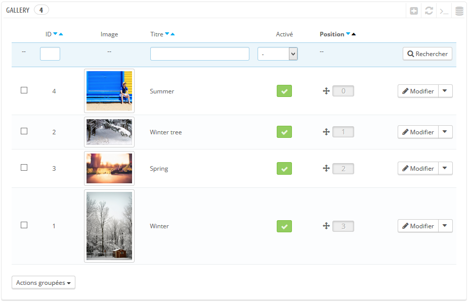

Configuration
=============

Configuring the module is really easy.

Once on the configuration page, you will see an empty table.

Click on Add
^^^^^^^^^^^^

Configure your picture
^^^^^^^^^^^^^^^^^^^^^^
.. image:: img/config_2.png
   :alt: Add a picture form

* Click on Choose a file to add a picture (step 1)
* Enter a title for your picture (step 2)
* If you want, change the language to enter a different picture and title (step 3)
* Enable or Disable the picture (step 4)
* Save your modifications (step 5)

After adding some pictures, the table will look like this
^^^^^^^^^^^^^^^^^^^^^^^^^^^^^^^^^^^^^^^^^^^^^^^^^^^^^^^^^
.. image:: img/config_3.png
   :alt: Full table

You can modify each picture by clicking on Modify

You can also change the position of the pictures
^^^^^^^^^^^^^^^^^^^^^^^^^^^^^^^^^^^^^^^^^^^^^^^^
.. image:: img/config_4.png
   :alt: Change position

* First, sort the pictures by position (step 1)
* Then drag the picture you want and drop it where you want (step 2)

