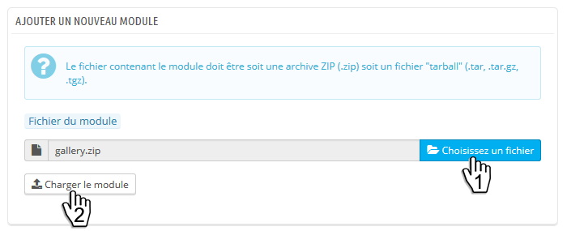
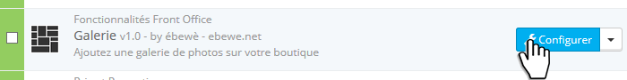
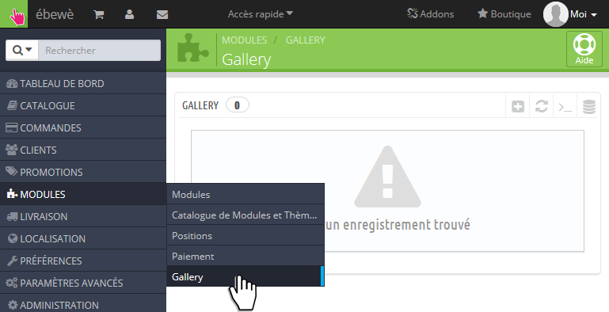

Installation
============

To install the module, follow these steps:

First, go to Modules page in your Back-Office
^^^^^^^^^^^^^^^^^^^^^^^^^^^^^^^^^^^^^^^^^^^^^
.. image:: img/install_1.png
   :alt: Go to Modules page

Then, click on Add a new module
^^^^^^^^^^^^^^^^^^^^^^^^^^^^^^^

Choose the file on your computer (step 1) and Upload the module to your shop (step 2)
^^^^^^^^^^^^^^^^^^^^^^^^^^^^^^^^^^^^^^^^^^^^^^^^^^^^^^^^^^^^^^^^^^^^^^^^^^^^^^^^^^^^^

Click on Install
^^^^^^^^^^^^^^^^
.. image:: img/install_4.png
   :alt: Install the module

The Gallery module is now installed.
To configure it, you have 2 choices:

Click on Configure
^^^^^^^^^^^^^^^^^^

Click on Modules > Gallery
^^^^^^^^^^^^^^^^^^^^^^^^^^

Installation is complete ! You can now go to :ref:`configuration`